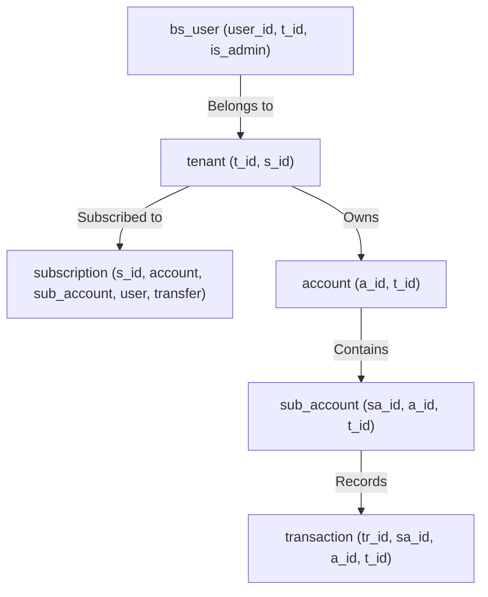
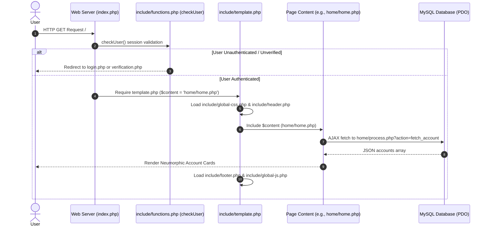

# System Architecture & Technical Specification — ABACOOS v2

---

## 1. System Overview & Technology Stack

**ABACOOS v2** is a multi-tenant accounting and personal/family financial management platform built using a modular PHP core.

### Core Stack
- **Backend Language**: PHP 8.2 (Vanilla, procedural + function-oriented routing)
- **Database**: MySQL / MariaDB (PDO driver, persistent connection, UTF-8 MB4)
- **Frontend Stack**: Bootstrap 4 + Neumorphism UI Pro + Custom Vanilla CSS (`css/style.css`)
- **Typography & Assets**: Inter font (Google Fonts), Font Awesome 6 icons, custom inline & SVG assets
- **JavaScript & Interactivity**: jQuery, DataTables BS5, Select2, SweetAlert2 (`.neu-popup` styling)
- **Templating**: Partial dynamic layout rendering (`template.php` shell wrapper)
- **Email Infrastructure**: PHPMailer (SMTP alert notifications)

---

## 2. Multi-Tenancy Architecture & Subscription Engine

ABACOOS v2 enforces tenant isolation across all domain modules using `t_id` (Tenant ID).



### Tenant Limits Matrix (`tenant` & `subscription` tables)
- Each tenant record copies feature limits from `subscription` (`s_id`: Free=1, Basic=2, Pro=3).
- **`account`**: Limit on main financial accounts (0 = unlimited).
- **`sub_account`**: Limit on sub-ledgers (0 = unlimited).
- **`user`**: Limit on invited team members (0 = unlimited).
- **`transfer`**: Flag for cross-account fund transfer functionality.
- Limit checks are performed dynamically in processing scripts (`account/process.php`, `sub-account/process.php`, `user/process.php`) before executing INSERT queries.

---

## 3. Application Request-Response Cycle & Layout Architecture



---

## 4. Folder Structure & Code Organization Standard

The project repository follows a strict modular structure by domain feature:

```
abacoos-v2/
├── index.php                      # Root entry point for Dashboard
├── login.php / sign-up.php         # Public authentication flows
├── global-library/
│   └── database.php               # PDO DB connection, timezone, sessions, constants
├── include/                       # Global shell components & system helpers
│   ├── template.php               # Root layout wrapper (Header + Content + Footer)
│   ├── header.php                 # Global navigation & brand header
│   ├── footer.php                 # Site footer
│   ├── global-css.php             # Stylesheet includes (FontAwesome, Neumorphism, Custom CSS)
│   ├── global-js.php              # JS plugin imports (jQuery, Select2, DataTables)
│   └── functions.php              # Core business & auth logic (doLogin, doRegister)
├── assets/                        # Static UI assets
│   ├── css/ (neumorphism.css, style.css)
│   └── img/ (brand SVGs, custom icons)
├── [module_name]/                 # Domain-driven feature modules
│   ├── index.php                  # Module entry point
│   ├── list.php                   # Data view / Table presentation
│   ├── process.php                # AJAX Action Router & PDO handlers
│   └── modal-*.php                # Create/Edit modal dialogs
└── Zero-second brain/             # Obsidian Knowledge Base & Technical Documentation
```

### Domain Modules Catalog
- **`home/`**: Main account overview cards & greeting widget
- **`account/`**: Top-level financial accounts management (Bank, Cash, Savings)
- **`sub-account/`**: Sub-ledgers attached to main accounts
- **`category/`**: Transaction categorization (Income/Expense categories)
- **`transaction/`**: Ledger entries (Debit/Credit records)
- **`user/`**: Team member invitations & access management
- **`activity-log/`**: Audit trail logging user actions (`activity_log` table)

---

## 5. Security & Data Validation Standards

1. **Authentication**: `checkUser()` runs on every page entry via `template.php`. Sessions store `user_id` and `t_id`.
2. **Prepared Statements**: All database operations use PDO prepared queries (`:param` bindings) to protect against SQL Injection.
3. **Soft Deletes**: Deletion sets `is_deleted = 1`, `date_deleted`, and `deleted_by`, preserving data integrity.
4. **Input Sanitization**: User input is trimmed and escaped using `escapeHtml()` on the client side and sanitized server-side before execution.
