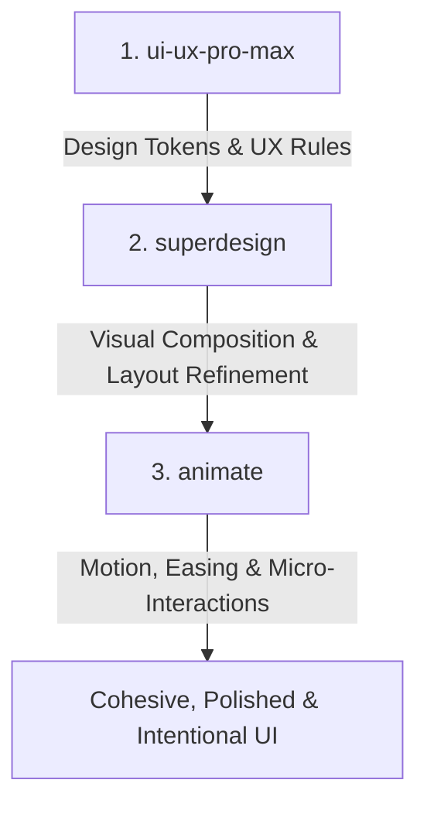

# Agent Skill Workflow & Design Governance — ABACOOS v2

---

## 1. Overview & Workflow Execution Order

To create cohesive, high-quality, human-designed UI/UX experiences, all design and frontend modifications must follow a **strict 3-tier skill execution hierarchy**.

When executing UI/UX work, skills MUST be used in this precise order:

1. **`ui-ux-pro-max`** — Establish the design system, color palette, typography, and UX direction.
2. **`superdesign`** — Refine the visual composition, hierarchy, and distinctive UI character.
3. **`animate`** — Add purposeful motion, timing, easing, and interactive feedback.

---

## 2. Skill Responsibilities & Governance Matrix

Each skill has a dedicated, non-overlapping responsibility. Skills **must never override or cross into another skill's domain**.

| Skill | Primary Responsibilities | Domain Boundaries & Constraints |
| :--- | :--- | :--- |
| **`ui-ux-pro-max`**  *(Source of Truth)* | • Typography & Font scale • Color tokens & palettes • Spacing scale & layout grid • UX patterns & accessibility • Component visual language | **Does NOT handling motion or layout placement.** Serves as the single source of truth for design system tokens. |
| **`superdesign`**  *(Visual Refinement)* | • Visual composition • Page & component layout hierarchy • Distinctive visual character • Aesthetic refinement & canvas drafts | **Must adhere to `ui-ux-pro-max` design tokens.** Does NOT invent arbitrary colors or fonts outside the established system. |
| **`animate`**  *(Motion Engineering)* | • Purposeful motion & micro-interactions • Easing curves & duration timing • Entrance & exit behaviors • Interactive hover/active feedback | **Focuses purely on motion.** Does NOT alter colors, static layouts, or core component styling established by prior tiers. |

---

## 3. Pre-Implementation Workflow Protocol

Before modifying any source code in the repository for UI/UX tasks, the agent MUST:

1. **Codebase Analysis**: Inspect existing component source code, CSS tokens, and render branches.
2. **Proposed Approach Explanation**: Present a concise proposal outlining:
   - Tokens derived from `ui-ux-pro-max`.
   - Layout & visual hierarchy structured via `superdesign`.
   - Motion & easing curves engineered via `animate`.
3. **User Alignment**: Wait for approval or feedback on the proposed approach before modifying files.

---

## 4. Design Goal

The combined outcome of this 3-tier workflow ensures the UI feels **cohesive, polished, intentional, and human-crafted** rather than generic or AI-generated.
